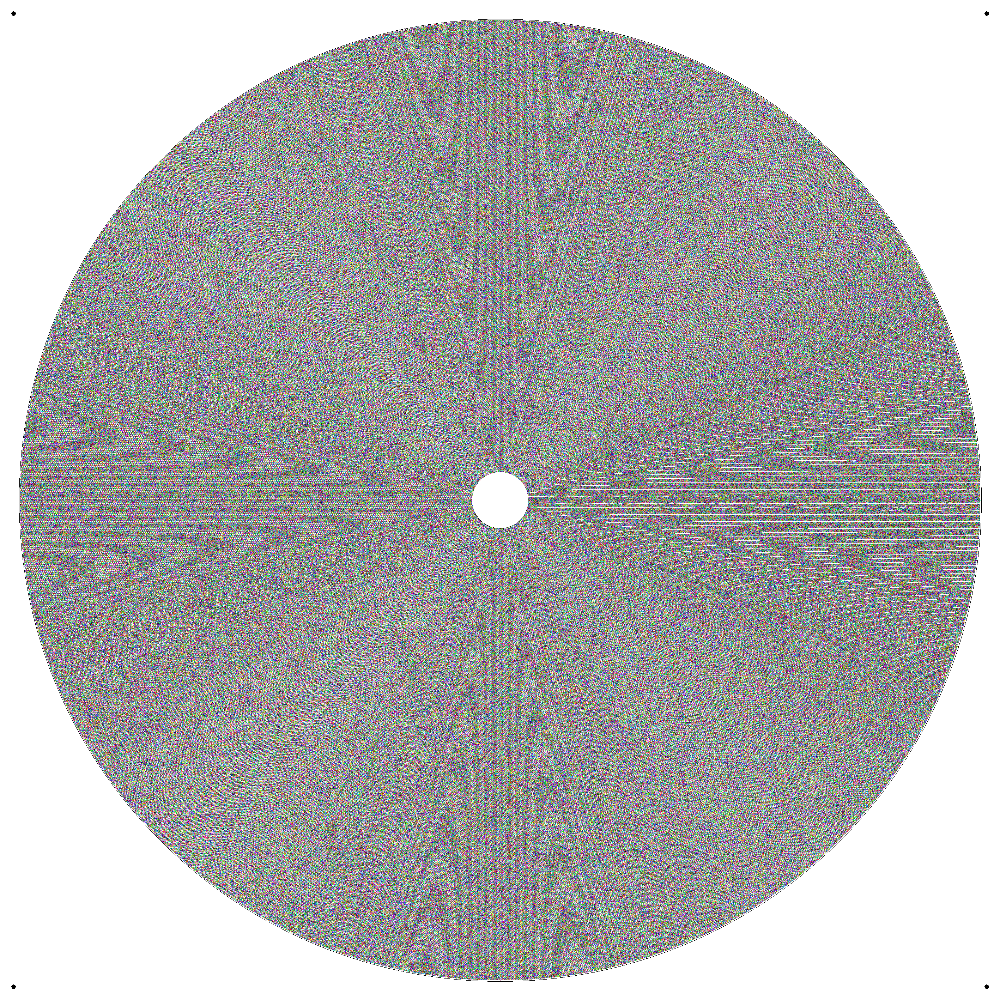
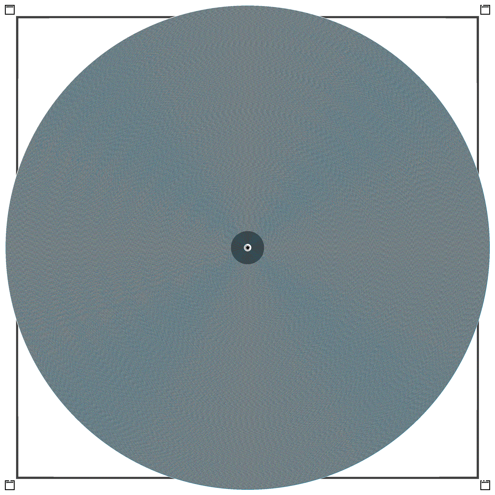

# CD Encoder

CD Encoder stores an audio file as a lossless WebP image and can recover the original bytes with SHA-256 verification. The web interface can choose between the CD, DVD, and Blu-ray encoders; the CLI uses the DVD encoder.

This is an experimental digital storage format. It is not CD-DA or DVD-Video and cannot be played directly by a conventional disc player.

## Purpose

The project started out of curiosity and as a small experiment for fun.

While working on it, I wondered whether the idea could become a larger project that converts audio into image files with optional copyright protection or encryption. An encrypted image could require a key before the audio can be recovered. These capabilities are ideas for future development; the current implementation does not provide encryption, copyright protection, or censorship resistance.

Given these premises, this project might evolve into a tool that helps people circumvent censorship.

## License

This project is open-source software licensed under the MIT License. See [LICENSE](./LICENSE) for the full license text.

You can freely use, modify, and distribute it in both personal and commercial projects.
You must include the original copyright notice and permission notice in your copies or substantial portions of the software.
The software comes with no warranty, and the authors are not liable for damages.

## Current Format

- Image format: lossless WebP
- Format version: `7`
- Default image resolution: `600 DPI` (`2835 x 2835` pixels)
- Payload encoding: RGB 8-8-8, three audio bytes per payload pixel
- Spiral pitch: `0.06 mm`
- Header: format version, DPI, image dimensions, audio size, SHA-256, and metadata
- Metadata fields: title, artist, album, and year
- Metadata storage: four fixed fields of up to `128` bytes in the custom image header
- Encoding configuration: JSON properties stored in the WebP XMP chunk
- Pixel header size: `573` bytes (`61` bytes core header + `512` bytes audio metadata)

Audio metadata remains in the custom pixel header, while the `encoding` and `technical` entries are stored in the WebP XMP chunk and can be read before pixel decoding. During decoding, valid XMP values override the local default constants; missing XMP values fall back to those defaults.

The web interface supports WebP encode/decode and lets the user choose `CdStyleEncoder`, `DvdStyleEncoder`, or `BluRayStyleEncoder` for each operation. Metadata and technical MP3 data are shown in separate interface panels. DVD remains the default selection for compatibility.

The current CD layout keeps a 2-pixel gray outline around the audio ring and uses four 0.5 mm black corner markers, matching the DVD-style visual orientation system while leaving the 58 mm payload annulus clear and readable.

## DVD Format

The active `DvdStyleEncoder` implementation stores MP3 bytes in a lossless WebP image. It supports two profiles:

- `standard`: `600 DPI`, suitable for normal use;
- `digital_max`: `1200 DPI`, for higher payload density.

The DVD format uses format version `1`, RGB 8-8-8 payload pixels, three audio bytes per payload pixel, and a `571`-byte header. The generated image size is calculated from the payload and profile, up to the implementation limit of `8000 x 8000` pixels. DVD images are self-describing: the profile and encoding configuration are stored in the WebP XMP metadata and are used during decoding.

The original CD format remains supported by the `CdStyleEncoder` class for existing format version `7` images. CD and DVD images are different formats and are not interchangeable.

## Blu-ray Format

The `BluRayStyleEncoder` stores audio in a lossless WebP ring layout using format version `1` and a fixed `600 DPI` profile. The standard `2835 x 2835` image provides approximately `15,576,180` audio payload bytes, or about `14.9 MiB`, before larger image sizes are considered.

- Unused audio-annulus pixels remain cerulean.
- The white inner disc and black center mark are preserved.
- Four corner blocks contain redundant copies of the format header and metadata.
- Corner marker borders and identity bits are used for rotation detection.
- A damaged primary metadata ring can be recovered from a majority of readable corner copies.
- A SHA-256 mismatch is treated as a decode failure.

Blu-ray images are not interchangeable with CD or DVD images. A Blu-ray image must be decoded with `BluRayStyleEncoder`.

## Requirements

- PHP 8.4 or newer
- GD with WebP support
- FFmpeg installed at `/usr/bin/ffmpeg`
- Composer dependencies from `composer.json`

Check the required executables:

```bash
ffmpeg -version
ffprobe -version
```

The web application transcodes uploaded audio to `64 kbps` before encoding. The `CdEncoder` class itself encodes the file it receives. The transcoded file is temporary and is removed after the image is generated. FFmpeg copies the source metadata into ID3v2.3 and ID3v1 tags.

## Installation

Run the following commands from the repository root:

```bash
composer install --no-interaction
```

Composer installs:

- `james-heinrich/getid3` for ID3 metadata parsing;
- `symfony/process` for managing FFmpeg processes;
- `symfony/http-foundation` for HTTP requests and responses;
- `symfony/console` for the command-line interface;
- `twig/twig` for rendering the web interface;
- `ramsey/uuid` for generated file names;
- `monolog/monolog` for PSR-3 logging;
- `phpstan/phpstan` for static analysis;
- `phpunit/phpunit` for tests;
- `friendsofphp/php-cs-fixer` for PHP code formatting.

FFmpeg itself is a system executable and must be installed separately. On Debian or Ubuntu:

```bash
sudo apt update
sudo apt install ffmpeg
```

## PHP API

Encode an audio file:

```php
use AudioImageEncoder\Application\Services\DvdStyleEncoder;
use Psr\Log\NullLogger;

$encoder = new DvdStyleEncoder(new NullLogger());
$encoder->prepare($audioPath, $imagePath);
$encoder->encode();
```

Decode an image:

```php
use AudioImageEncoder\Application\Services\DvdStyleEncoder;
use Psr\Log\NullLogger;

$decoder = new DvdStyleEncoder(new NullLogger());
$decoder->prepare($audioOutputPath, $imagePath);
$decoder->decode();
$metadata = $decoder->getMetadata();
```

`getMetadata()` returns an array with these keys:

```php
[
    'title' => '',
    'artist' => '',
    'album' => '',
    'year' => '',
    'technical' => [
        'bitrate_kbps' => 64.0,
        'sample_rate_hz' => 44100,
        'channels' => 2,
        'codec' => 'mp3',
        'duration_seconds' => 0.0,
        'file_size_bytes' => 0,
    ],
    'encoding' => [
        'format_version' => 1,
        'profile' => 'standard',
        'disc_diameter_mm' => 120.0,
        'dpi' => 600,
        'inner_radius_px' => 80,
        'margin_px' => 12,
        'fill_factor' => 0.9,
        'payload_bytes_per_pixel' => 3,
        'metadata_field_length' => 128,
    ],
]
```

## CLI

The CLI entry point is `public/cli.php`:

```bash
php public/cli.php audio-image-encoder encode input.mp3 output.webp cd
php public/cli.php audio-image-encoder encode-max input.mp3 output.webp dvd
php public/cli.php audio-image-encoder encode input.mp3 output.webp bluray
php public/cli.php audio-image-encoder decode input.webp recovered.mp3 bluray
```

The encoder argument is optional and defaults to `dvd`, preserving the original command form. It accepts `cd`, `dvd`, or `bluray`. `encode-max` is available only for the DVD encoder and uses its `digital_max` profile. The CLI does not transcode audio; the web upload flow performs the `64 kbps` conversion before encoding.

Application logs are written to `logs/cd-encoder.log`. Runtime log files are excluded from Git.

## Tests

Run the PHPUnit suite from `src`:

```bash
cd src
php vendor/bin/phpunit --configuration phpunit.xml
```

The tests cover:

- encode/decode of an odd-length payload;
- byte-for-byte recovery verified by SHA-256;
- empty metadata handling for an untagged audio file;
- recovery of the encoding constants and MP3 technical data stored in WebP XMP.

The separated encoder test files cover CD, DVD, and Blu-ray round trips, odd-length payloads, visual format rules, metadata/configuration, and Blu-ray corner fallback. The current focused result is:

```text
OK (6 tests)
```

Run PHPStan at level 9:

```bash
php vendor/bin/phpstan analyse --configuration phpstan.neon --no-progress
```

Format PHP files with PHP CS Fixer:

```bash
cd src
php vendor/bin/php-cs-fixer fix AudioImageEncoder
```

## Important Compatibility Notes

- Images created with older format versions are not compatible with format version `7`.
- If the source metadata changes, regenerate the WebP image.
- Lossless recovery depends on using lossless WebP. Lossy image compression can corrupt payload bytes and cause a SHA-256 mismatch.
- Reducing the image resolution or changing spiral constants requires matching encoder and decoder changes and new round-trip tests.

## Example images

The repository includes generated reference images for the current encoder layouts:

- `examples/cd-example.webp`
- `examples/dvd-example.webp`
- `examples/bluray-example.webp`

The CD and DVD examples are lossless WebP round-trip references. Their visual geometry includes the outer gray ring border and the corner marker placement used by the active encoder implementations.

## Example image

This is an example of a generated image:





## Demo

You can see a demo at https://cdencoder.muzichii.ro
